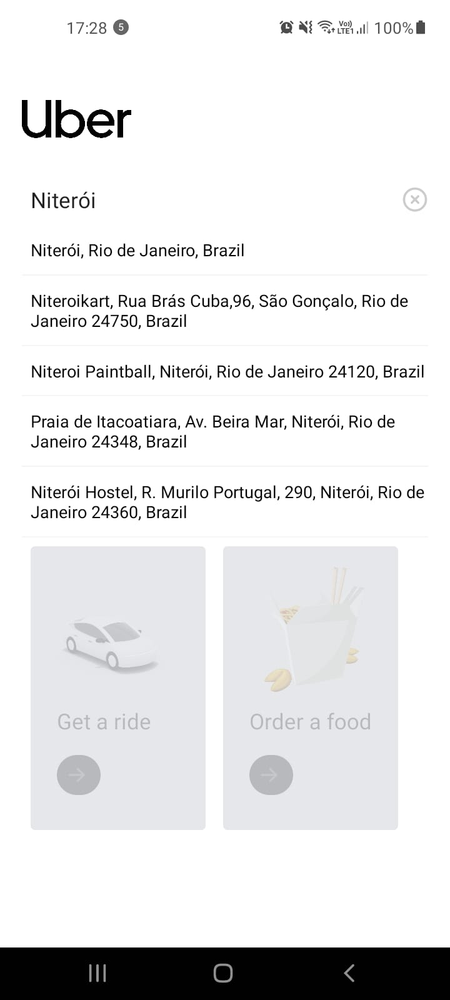
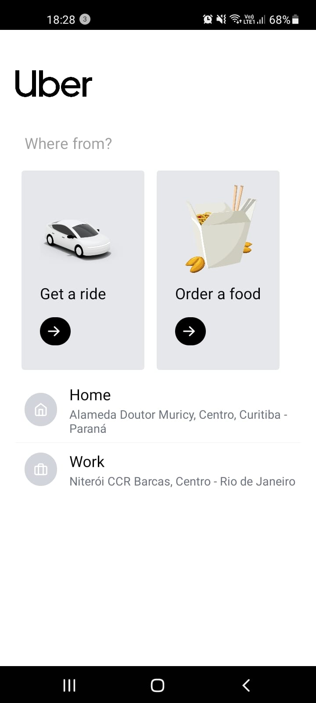
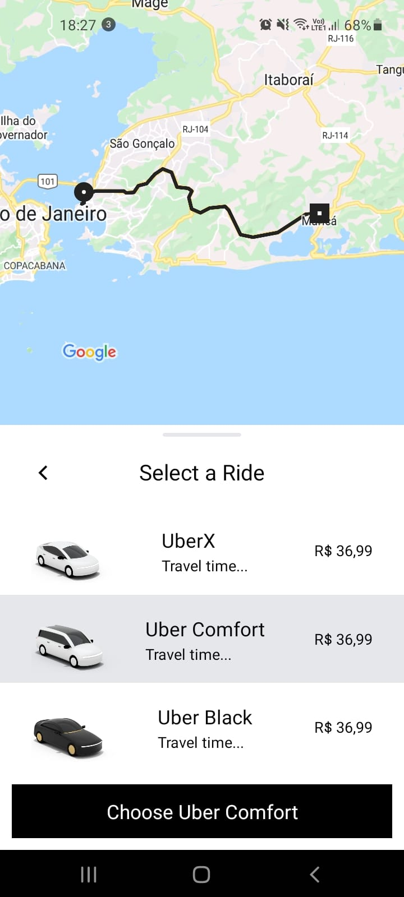

# Uber Clone TypeScript
Clone da aplicação Uber utilizando as tecnologias:

React Native | Tailwind | Zustand | Mapbox API | Maps | Navigation | Directions

## Destaques Implementados:
- Zero custo para utilizar as API, direfente do Google Maps onde é necessário utilizar o cartão de crédito 0️⃣.
- Tailwind com React Native 🍀.
- Zustand para gerenciamento de estado das cooredenas de origem e destino 🐻.
- Navegação entre rotas com React Navigation 🛣️.
- Matrix API para calcular tempo de viagem e preço.
- Directions API para traçar uma rota de ponto origem e destino.
- Os locais de busca são de acordo com a localização atual do GPS do usuário 📍.
- Técnica de debounce para buscar as rotas conforme o usuário digita.
- Poline para desenhar a linha das rotas de origem e destino.

## Images

  
  
  
  

